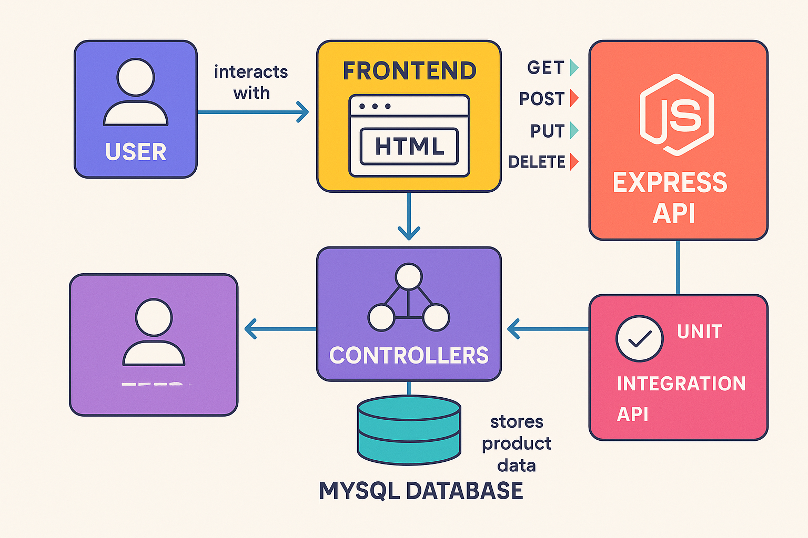
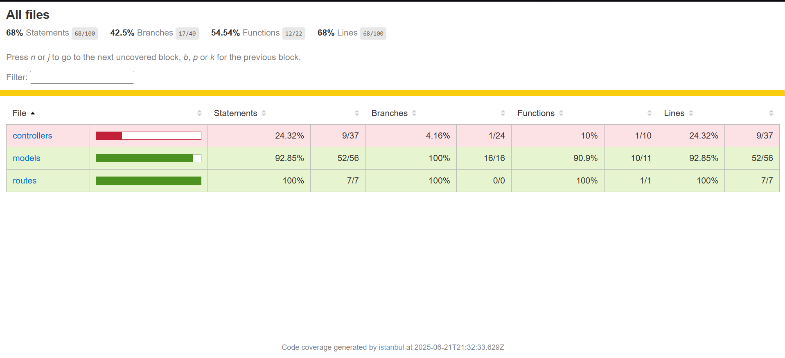

# Product Manager API – Keploy API Fellowship Project

A full-stack CRUD application built with **Node.js**, **Express**, and **MySQL** for managing products. Includes a simple HTML frontend for easy interaction and testing, and full automated testing with Jest and Supertest.

---

---

## 🚀 Features

- RESTful API with Create, Read, Update, Delete (CRUD) endpoints for products
- MySQL database integration
- MVC folder structure for clean code organization
- Simple frontend (`public/index.html`) to interact with the API
- **Automated tests:** Unit, integration, and API tests
- Code coverage reporting

---

## 🛠️ Tech Stack

- **Backend:** Node.js, Express.js
- **Database:** MySQL (mysql2)
- **Testing:** Jest (test runner & coverage), Supertest (API endpoint testing)
- **Other:** dotenv (environment variables), body-parser, cors

---

## 🧩 API Integrated

This project exposes and tests a custom REST API for product management, including:

| Method | Endpoint                   | Description                |
|--------|----------------------------|----------------------------|
| GET    | /api/products              | Get all products           |
| GET    | /api/products/:id          | Get a product by ID        |
| POST   | /api/products              | Create a new product       |
| PUT    | /api/products/:id          | Update a product by ID     |
| DELETE | /api/products/:id          | Delete a product by ID     |

---

## 🚦 Getting Started

### 1. Clone the Repository

git clone https://github.com/stealthinator45/product-manager-api.git
cd product-manager-api

text

### 2. Install Dependencies

npm install

text

### 3. Set Up the Database

- Start MySQL and run the scripts in the `sql/` folder:

SOURCE sql/create_db.sql;
USE keploy_api_db;
SOURCE sql/create_table.sql;
SOURCE sql/seed_data.sql;

text

### 4. Configure Database Connection

- Copy `.env.example` to `.env` and fill in your MySQL credentials.

Example:
DB_HOST=localhost
DB_USER=your_mysql_user
DB_PASSWORD=your_mysql_password
DB_NAME=keploy_api_db

text

### 5. Start the Server

npm start

text

- You should see:  
  `Server is running on port 3000.`  
  `Successfully connected to the database.`

---

## 🧪 How to Run Tests

- **All tests (with coverage):**
npm test

text
- **Unit tests only:**
npm run test:unit

text
- **Integration tests only:**
npm run test:integration

text
- **API tests only:**
npm run test:api

text

---

## 🧰 Testing Frameworks/Tools Used

- **Jest** – test runner, assertions, and coverage
- **Supertest** – HTTP assertions for API endpoints

---

## 🌐 Using the Frontend

- Open [http://localhost:3000/public/index.html](http://localhost:3000/public/index.html) in your browser.
- Use the form to add, edit, or delete products.
- All products are displayed in the table.

---

## 📊 Test Coverage

> **Screenshot:**  
> 
>
> _After running `npm test`, open `coverage/lcov-report/index.html` to see the full coverage report. Add a screenshot of the summary table here._

---

## 📂 Project Structure

product-manager-api/
│
├── controllers/
├── models/
├── routes/
├── tests/
│ ├── unit/
│ ├── integration/
│ └── api/
├── config/
├── public/
├── sql/
├── .env.example
├── package.json
├── README.md
└── ...

text

---

## 📄 License

This project is for educational/demo purposes as part of the Keploy API Fellowship.

---

## 🙌 Author

**Piyush Kumar Tiwari**  
[GitHub](https://github.com/stealthinator45) | [LinkedIn](https://www.linkedin.com/in/piyush-kumar-tiwari-a6a800256/)

---

## 💡 Notes

- Use **Node.js v18.x** for best compatibility (Node.js v20+ is not supported by `mysql2`).
- Ensure your MySQL server is running and accessible.
- For test DB, you can manually create and seed it, or let the tests use your existing data.
- For production, use environment variables for sensitive data and add more robust error handling and validation.
- Contributions welcome!
