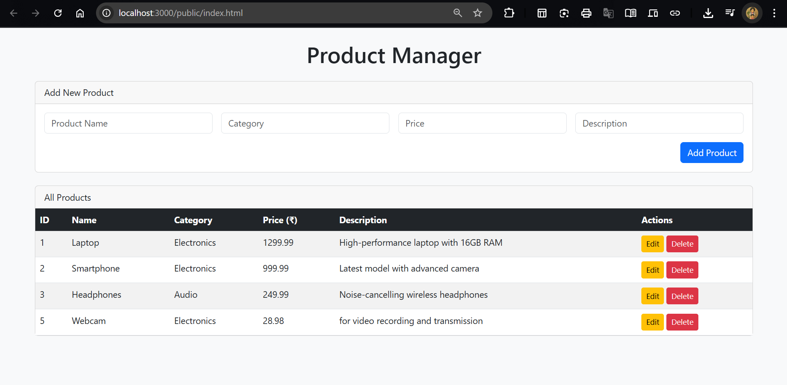
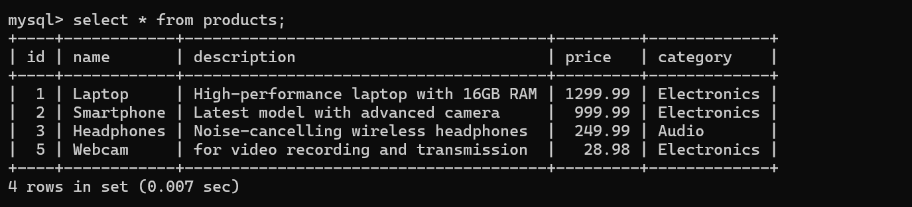
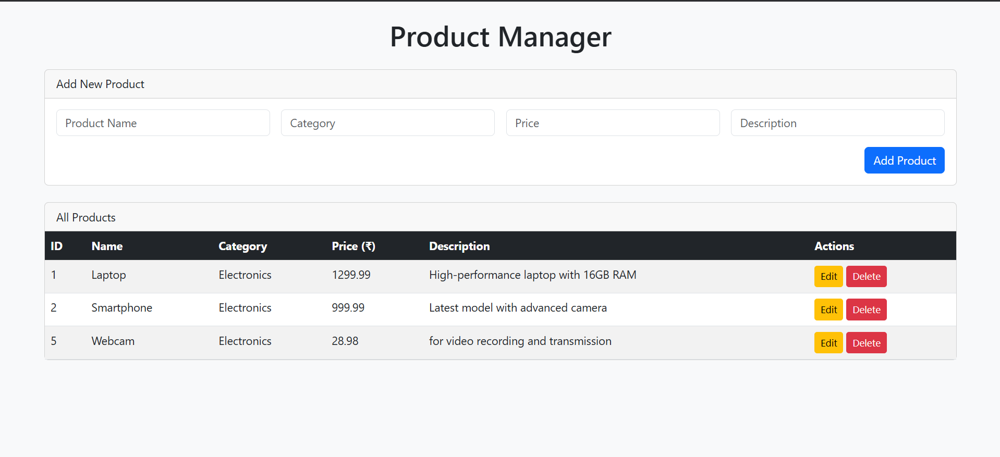
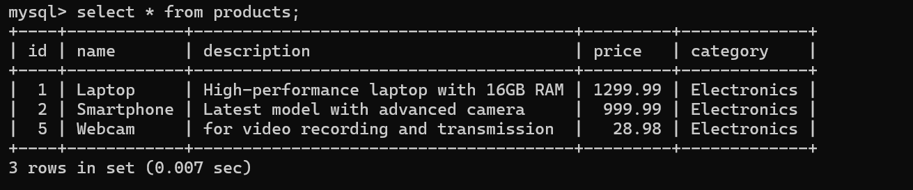

# Product Manager API – Keploy API Fellowship Project

A full-stack CRUD application built with **Node.js**, **Express**, and **MySQL** for managing products. Includes a simple HTML frontend for easy interaction and testing.

---

## 🚀 Features

- RESTful API with Create, Read, Update, Delete (CRUD) endpoints for products
- MySQL database integration
- MVC folder structure for clean code organization
- Simple frontend (`public/index.html`) to interact with the API
- Easy to set up and extend

---

## 🗂️ Project Structure

api-server/
├── config/
│ └── db.js
├── controllers/
│ └── productController.js
├── models/
│ └── product.model.js
├── routes/
│ └── product.routes.js
├── public/
│ └── index.html
├── sql/
│ ├── create_db.sql
│ ├── create_table.sql
│ └── seed_data.sql
├── .gitignore
├── package.json
├── server.js
└── README.md

text

---

## 🛠️ Getting Started

### Prerequisites

- Node.js (v12+)
- MySQL Server

### 1. Clone the Repository

git clone <your-repo-url>
cd api-server

text

### 2. Install Dependencies

npm install

text

### 3. Set Up the Database

- Start MySQL and run the scripts in the `sql/` folder:

-- In MySQL shell:
SOURCE sql/create_db.sql;
USE keploy_api_db;
SOURCE sql/create_table.sql;
SOURCE sql/seed_data.sql;

text

### 4. Configure Database Connection

- Edit `config/db.js` with your MySQL credentials:

const connection = mysql.createConnection({
host: "localhost",
user: "your_mysql_user",
password: "your_mysql_password",
database: "keploy_api_db"
});

text

### 5. Start the Server

node server.js

text

- You should see:  
  `Server is running on port 3000.`  
  `Successfully connected to the database.`

---

## 🌐 API Endpoints

| Method | Endpoint                   | Description                |
|--------|----------------------------|----------------------------|
| GET    | /api/products              | Get all products           |
| GET    | /api/products/:id          | Get a product by ID        |
| POST   | /api/products              | Create a new product       |
| PUT    | /api/products/:id          | Update a product by ID     |
| DELETE | /api/products/:id          | Delete a product by ID     |

---

## 🖥️ Using the Frontend

- Open [http://localhost:3000/public/index.html](http://localhost:3000/public/index.html) in your browser.
- Use the form to add, edit, or delete products.
- All products are displayed in the table.

---

## 📸 Screenshots

---

## 📄 License

This project is for educational/demo purposes as part of the Keploy API Fellowship.

---

## 🙌 Author

**Piyush Kumar Tiwari**  
[GitHub](https://github.com/stealthinator45) | [LinkedIn](https://www.linkedin.com/in/piyush-kumar-tiwari-a6a800256/)

---

## 💡 Notes

- For production, use environment variables for sensitive data and add more robust error handling and validation.
- Contributions welcome!
